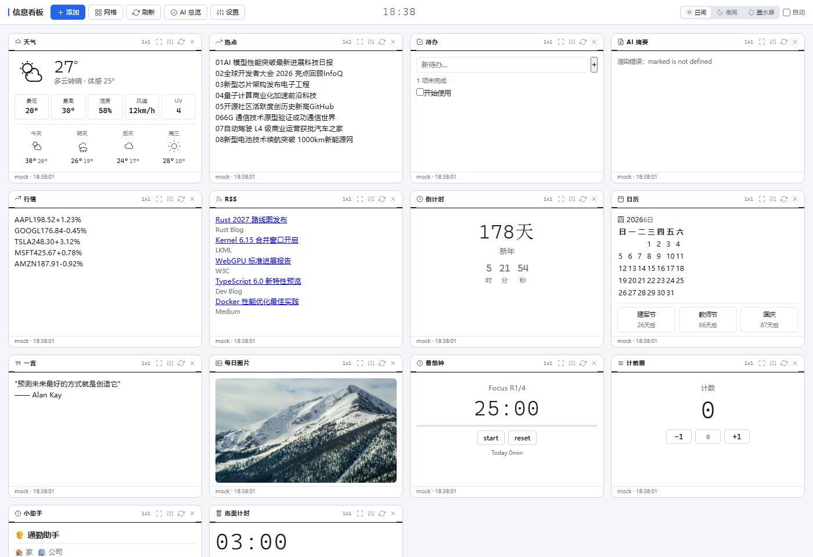

# 线稿 · 信息看板

一个功能丰富的个人信息聚合看板，单 HTML 文件，双击即用。支持浏览器直接打开和 Android APK 安装。



## 功能

### 📦 模块窗口（15 种）
| 模块 | 说明 |
|------|------|
| 🌤 **天气** | 实时天气、体感温度、湿度、风速、UV、未来 X 天预报 |
| 🔥 **热点** | 信息列表 |
| ✅ **待办** | 添加 / 编辑 / 删除待办，localStorage 持久化 |
| 🤖 **AI 摘要** | 配置 DeepSeek 后可自动生成 Markdown 摘要 |
| 📊 **行情** | 股票价格变动 |
| 📰 **RSS** | 填入订阅源 URL，自动通过 rss2json 免费服务抓取 |
| ⏱ **倒计时** | 目标日期实时倒计时（天/时/分/秒） |
| 📅 **日历** | 农历 + 13 个节假日标注 + 最近 3 个节日倒计时 |
| 💬 **一言** | 随机名言展示 |
| 🖼 **每日图片** | 随机图片展示，双源自动回退 |
| 🍅 **番茄钟** | 专注 / 休息计时器，多轮次，今日统计 |
| 🔢 **计数器** | +/-/归零，步长可调，支持负数 |
| 🧑 **小助手** | 通勤提醒，上班/下班时间，工作日选择，AI 建议 |
| 🍜 **泡面计时** | 1-5 分钟快速计时，5 个进度点显示 |
| 🕐 **时钟** | 工具栏实时时钟，4 种样式可切换 |

### 🎨 界面布局
- **网格模式** — 窗口自动排列，支持 1×1 / 2×1 / 1×2 / 2×2 大小切换
- **浮动模式** — 左侧 dock 图标栏，点击弹出窗口，支持拖拽移动和缩放
- **全屏模式** — 每个窗口右上角 ⛶ 按钮，近全屏显示
- **日间 / 夜间 / 墨水屏** — 一键切换，支持定时自动切换
- **字体大小 / 面板宽度** — 自由调节

### 🤖 AI 集成
- **AI 总览** — DeepSeek 自动生成全局摘要 + 对话提问
- **联网搜索** — Wikipedia API 自动补充信息
- **语音指令** — 输入 `添加待办: xxx`、`天气改上海`、`倒计时 2027-12-31, 跨年` 等，AI 自动执行
- **提示词预设** — 综合总览 / 重点关注 / 趋势分析 / 风险提示 / 行动建议

### 🔌 数据源配置
- **Mock 模式** — 内置示例数据，开箱即用
- **API 模式** — 对接自定义后端，遵循 `/widgets/{type}` 格式
- **DeepSeek** — 填入 API Key 开启 AI 摘要 / AI 总览 / 通勤建议 / 对话功能
- **RSS** — 即使 Mock 模式下，填入订阅源 URL 即可自动抓取

### 💾 数据持久化
所有动态数据自动保存到 localStorage：设置、待办项、计数器值、番茄钟状态、倒计时、泡面计时等。关闭页面再打开自动恢复。

### 📱 Android APK
项目附带 Android 端 WebView 封装 APK，支持 Android 5.0+，功能与浏览器版完全一致。

## 快速开始

**浏览器**：直接双击 `index.html`

**局域网**：
```bash
python3 -m http.server 3000 --bind 0.0.0.0
```
访问 `http://你的IP:3000`

**Android**：安装 `dashboard.apk`

## 设置

点击工具栏「设置」按钮 → 滚动配置面板：

- **数据源** — API Base URL / Mock 开关
- **DeepSeek** — API Key / 模型选择 / 测试连接
- **AI 总览** — 提示词预设 / 联网搜索开关
- **日夜切换** — 自动切换起止时间
- **外观** — 时钟样式 / 字体大小 / 面板宽度
- **模块可见性** — 显示/隐藏模块类型
- **使用教程** — 内置完整功能说明

## 技术栈

- 纯前端，单 HTML 文件（约 90KB）
- 线条风设计，CSS 变量换肤
- DeepSeek API（AI 对话 + 摘要 + 指令）
- Wikipedia API（联网搜索）
- rss2json.com（RSS 解析）
- localStorage（数据持久化）

## License

MIT
